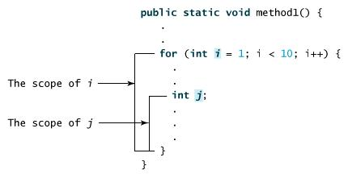

## 本文由以下元素组成

- 正式表达式

  - Matcher类的方法
  - matches和 lookingAt方法
  - replaceFirst和replaceAll方法
  - appendReplacement和appendTail方法
  - PatternSyntaxException类的方法

- 方法

  - 定义，调用，void关键字
  - 通过值传递参数
  - 方法重载
  - 变量作用域
  - 命令行参数的使用
  - 构造方法
  - 可变参数
  - finalize()方法
  
  

------

# Java 正则表达式

## 正则表达式

正则表达式定义了字符串的模式。

正则表达式可以用来搜索、编辑或处理文本。

正则表达式并不仅限于某一种语言，但是在每种语言中有细微的差别。

### 正则表达式

一个字符串其实就是一个简单的正则表达式，例如 **Hello World** 正则表达式匹配 "Hello World" 字符串。

**.**（点号）也是一个正则表达式，它匹配任何一个字符如："a" 或 "1"。

下表列出了一些正则表达式的实例及描述：

| 正则表达式       | 描述                                                         |
| :--------------- | :----------------------------------------------------------- |
| this is text     | 匹配字符串 "this is text"                                    |
| this\s+is\s+text | 注意字符串中的 **\s+**。匹配单词 "this" 后面的 **\s+** 可以匹配多个空格，之后匹配 is 字符串，再之后 **\s+** 匹配多个空格然后再跟上 text 字符串。可以匹配这个实例：this is text |
| ^\d+(\.\d+)?     | ^ 定义了以什么开始\d+ 匹配一个或多个数字? 设置括号内的选项是可选的\. 匹配 "."可以匹配的实例："5", "1.5" 和 "2.21"。 |

Java 正则表达式和 Perl 的是最为相似的。

java.util.regex 包主要包括以下三个类：

- Pattern 类：

  pattern 对象是一个正则表达式的编译表示。Pattern 类没有公共构造方法。要创建一个 Pattern 对象，你必须首先调用其公共静态编译方法，它返回一个 Pattern 对象。该方法接受一个正则表达式作为它的第一个参数。

- Matcher 类：

  Matcher 对象是对输入字符串进行解释和匹配操作的引擎。与Pattern 类一样，Matcher 也没有公共构造方法。你需要调用 Pattern 对象的 matcher 方法来获得一个 Matcher 对象。

- PatternSyntaxException：

  PatternSyntaxException 是一个非强制异常类，它表示一个正则表达式模式中的语法错误。

以下实例中使用了正则表达式 **.\*twly.\*** 用于查找字符串中是否包了 **twly**子串：

```java
import java.util.regex.*;
 
class RegexExample1{
   public static void main(String[] args){
      String content = "I am twly " +
        "from twly.com.";
 
      String pattern = ".*twly.*";
 
      boolean isMatch = Pattern.matches(pattern, content);
      System.out.println("字符串中是否包含了 'twly' 子字符串? " + isMatch);
   }
}
```

```java
字符串中是否包含了 'twly' 子字符串? true
```

### 捕获组

捕获组是把多个字符当一个单独单元进行处理的方法，它通过对括号内的字符分组来创建。

例如，正则表达式 (dog) 创建了单一分组，组里包含"d"，"o"，和"g"。

捕获组是通过从左至右计算其开括号来编号。例如，在表达式（（A）（B（C））），有四个这样的组：

- ((A)(B(C)))
- (A)
- (B(C))
- (C)

可以通过调用 matcher 对象的 groupCount 方法来查看表达式有多少个分组。groupCount 方法返回一个 int 值，表示matcher对象当前有多个捕获组。

还有一个特殊的组（group(0)），它总是代表整个表达式。该组不包括在 groupCount 的返回值中。

#### 实例

下面的例子说明如何从一个给定的字符串中找到数字串：

```java
import java.util.regex.Matcher;
import java.util.regex.Pattern;
 
public class RegexMatches
{
    public static void main( String[] args ){
 
      // 按指定模式在字符串查找
      String line = "This order was placed for QT3000! OK?";
      String pattern = "(\\D*)(\\d+)(.*)";
 
      // 创建 Pattern 对象
      Pattern r = Pattern.compile(pattern);
 
      // 现在创建 matcher 对象
      Matcher m = r.matcher(line);
      if (m.find( )) {
         System.out.println("Found value: " + m.group(0) );
         System.out.println("Found value: " + m.group(1) );
         System.out.println("Found value: " + m.group(2) );
         System.out.println("Found value: " + m.group(3) ); 
      } else {
         System.out.println("NO MATCH");
      }
   }
}
```

以上实例编译运行结果如下：

```java
Found value: This order was placed for QT3000! OK?
Found value: This order was placed for QT
Found value: 3000
Found value: ! OK?
```

### 正则表达式语法

在其他语言中，**\\** 表示：**我想要在正则表达式中插入一个普通的（字面上的）反斜杠，请不要给它任何特殊的意义。**

在 Java 中，**\\** 表示：**我要插入一个正则表达式的反斜线，所以其后的字符具有特殊的意义。**

所以，在其他的语言中（如 Perl），一个反斜杠 **\** 就足以具有转义的作用，而在 Java 中正则表达式中则需要有两个反斜杠才能被解析为其他语言中的转义作用。也可以简单的理解在 Java 的正则表达式中，两个 **\\** 代表其他语言中的一个 **\**，这也就是为什么表示一位数字的正则表达式是 **\\d**，而表示一个普通的反斜杠是 **\\**。

```java
System.out.print("\\");    // 输出为 \
System.out.print("\\\\");  // 输出为 \\
```

| 字符          | 说明                                                         |
| :------------ | :----------------------------------------------------------- |
| \             | 将下一字符标记为特殊字符、文本、反向引用或八进制转义符。例如， **n**匹配字符 **n**。**\n** 匹配换行符。序列 **\\\\** 匹配 **\\** ，**\\(** 匹配 **(**。 |
| ^             | 匹配输入字符串开始的位置。如果设置了 **RegExp** 对象的 **Multiline** 属性，^ 还会与"\n"或"\r"之后的位置匹配。 |
| $             | 匹配输入字符串结尾的位置。如果设置了 **RegExp** 对象的 **Multiline** 属性，$ 还会与"\n"或"\r"之前的位置匹配。 |
| *             | 零次或多次匹配前面的字符或子表达式。例如，zo* 匹配"z"和"zoo"。* 等效于 {0,}。 |
| +             | 一次或多次匹配前面的字符或子表达式。例如，"zo+"与"zo"和"zoo"匹配，但与"z"不匹配。+ 等效于 {1,}。 |
| ?             | 零次或一次匹配前面的字符或子表达式。例如，"do(es)?"匹配"do"或"does"中的"do"。? 等效于 {0,1}。 |
| {*n*}         | *n* 是非负整数。正好匹配 *n* 次。例如，"o{2}"与"Bob"中的"o"不匹配，但与"food"中的两个"o"匹配。 |
| {*n*,}        | *n* 是非负整数。至少匹配 *n* 次。例如，"o{2,}"不匹配"Bob"中的"o"，而匹配"foooood"中的所有 o。"o{1,}"等效于"o+"。"o{0,}"等效于"o*"。 |
| {*n*,*m*}     | *m* 和 *n* 是非负整数，其中 *n* <= *m*。匹配至少 *n* 次，至多 *m* 次。例如，"o{1,3}"匹配"fooooood"中的头三个 o。'o{0,1}' 等效于 'o?'。注意：您不能将空格插入逗号和数字之间。 |
| ?             | 当此字符紧随任何其他限定符（*、+、?、{*n*}、{*n*,}、{*n*,*m*}）之后时，匹配模式是"非贪心的"。"非贪心的"模式匹配搜索到的、尽可能短的字符串，而默认的"贪心的"模式匹配搜索到的、尽可能长的字符串。例如，在字符串"oooo"中，"o+?"只匹配单个"o"，而"o+"匹配所有"o"。 |
| .             | 匹配除"\r\n"之外的任何单个字符。若要匹配包括"\r\n"在内的任意字符，请使用诸如"[\s\S]"之类的模式。 |
| (*pattern*)   | 匹配 *pattern* 并捕获该匹配的子表达式。可以使用 **$0…$9** 属性从结果"匹配"集合中检索捕获的匹配。若要匹配括号字符 ( )，请使用"\("或者"\)"。 |
| (?:*pattern*) | 匹配 *pattern* 但不捕获该匹配的子表达式，即它是一个非捕获匹配，不存储供以后使用的匹配。这对于用"or"字符 (\|) 组合模式部件的情况很有用。例如，'industr(?:y\|ies) 是比 'industry\|industries' 更经济的表达式。 |
| (?=*pattern*) | 执行正向预测先行搜索的子表达式，该表达式匹配处于匹配 *pattern* 的字符串的起始点的字符串。它是一个非捕获匹配，即不能捕获供以后使用的匹配。例如，'Windows (?=95\|98\|NT\|2000)' 匹配"Windows 2000"中的"Windows"，但不匹配"Windows 3.1"中的"Windows"。预测先行不占用字符，即发生匹配后，下一匹配的搜索紧随上一匹配之后，而不是在组成预测先行的字符后。 |
| (?!*pattern*) | 执行反向预测先行搜索的子表达式，该表达式匹配不处于匹配 *pattern* 的字符串的起始点的搜索字符串。它是一个非捕获匹配，即不能捕获供以后使用的匹配。例如，'Windows (?!95\|98\|NT\|2000)' 匹配"Windows 3.1"中的 "Windows"，但不匹配"Windows 2000"中的"Windows"。预测先行不占用字符，即发生匹配后，下一匹配的搜索紧随上一匹配之后，而不是在组成预测先行的字符后。 |
| *x*\|*y*      | 匹配 *x* 或 *y*。例如，'z\|food' 匹配"z"或"food"。'(z\|f)ood' 匹配"zood"或"food"。 |
| [*xyz*]       | 字符集。匹配包含的任一字符。例如，"[abc]"匹配"plain"中的"a"。 |
| [^*xyz*]      | 反向字符集。匹配未包含的任何字符。例如，"[^abc]"匹配"plain"中"p"，"l"，"i"，"n"。 |
| [*a-z*]       | 字符范围。匹配指定范围内的任何字符。例如，"[a-z]"匹配"a"到"z"范围内的任何小写字母。 |
| [^*a-z*]      | 反向范围字符。匹配不在指定的范围内的任何字符。例如，"[^a-z]"匹配任何不在"a"到"z"范围内的任何字符。 |
| \b            | 匹配一个字边界，即字与空格间的位置。例如，"er\b"匹配"never"中的"er"，但不匹配"verb"中的"er"。 |
| \B            | 非字边界匹配。"er\B"匹配"verb"中的"er"，但不匹配"never"中的"er"。 |
| \c*x*         | 匹配 *x* 指示的控制字符。例如，\cM 匹配 Control-M 或回车符。*x* 的值必须在 A-Z 或 a-z 之间。如果不是这样，则假定 c 就是"c"字符本身。 |
| \d            | 数字字符匹配。等效于 [0-9]。                                 |
| \D            | 非数字字符匹配。等效于 [^0-9]。                              |
| \f            | 换页符匹配。等效于 \x0c 和 \cL。                             |
| \n            | 换行符匹配。等效于 \x0a 和 \cJ。                             |
| \r            | 匹配一个回车符。等效于 \x0d 和 \cM。                         |
| \s            | 匹配任何空白字符，包括空格、制表符、换页符等。与 [ \f\n\r\t\v] 等效。 |
| \S            | 匹配任何非空白字符。与 [^ \f\n\r\t\v] 等效。                 |
| \t            | 制表符匹配。与 \x09 和 \cI 等效。                            |
| \v            | 垂直制表符匹配。与 \x0b 和 \cK 等效。                        |
| \w            | 匹配任何字类字符，包括下划线。与"[A-Za-z0-9_]"等效。         |
| \W            | 与任何非单词字符匹配。与"[^A-Za-z0-9_]"等效。                |
| \x*n*         | 匹配 *n*，此处的 *n* 是一个十六进制转义码。十六进制转义码必须正好是两位数长。例如，"\x41"匹配"A"。"\x041"与"\x04"&"1"等效。允许在正则表达式中使用 ASCII 代码。 |
| \*num*        | 匹配 *num*，此处的 *num* 是一个正整数。到捕获匹配的反向引用。例如，"(.)\1"匹配两个连续的相同字符。 |
| \*n*          | 标识一个八进制转义码或反向引用。如果 \*n* 前面至少有 *n* 个捕获子表达式，那么 *n* 是反向引用。否则，如果 *n* 是八进制数 (0-7)，那么 *n* 是八进制转义码。 |
| \*nm*         | 标识一个八进制转义码或反向引用。如果 \*nm* 前面至少有 *nm* 个捕获子表达式，那么 *nm* 是反向引用。如果 \*nm* 前面至少有 *n* 个捕获，则 *n* 是反向引用，后面跟有字符 *m*。如果两种前面的情况都不存在，则 \*nm* 匹配八进制值 *nm*，其中 *n* 和 *m* 是八进制数字 (0-7)。 |
| \nml          | 当 *n* 是八进制数 (0-3)，*m* 和 *l* 是八进制数 (0-7) 时，匹配八进制转义码 *nml*。 |
| \u*n*         | 匹配 *n*，其中 *n* 是以四位十六进制数表示的 Unicode 字符。例如，\u00A9 匹配版权符号 (©)。 |

> 根据 Java Language Specification 的要求，Java 源代码的字符串中的反斜线被解释为 Unicode 转义或其他字符转义。因此必须在字符串字面值中使用两个反斜线，表示正则表达式受到保护，不被 Java 字节码编译器解释。例如，当解释为正则表达式时，字符串字面值 "\b" 与单个退格字符匹配，而 "\\b" 与单词边界匹配。字符串字面值 "\(hello\)" 是非法的，将导致编译时错误；要与字符串 (hello) 匹配，必须使用字符串字面值 "\\(hello\\)"。

------

## Matcher 类的方法

### 索引方法

索引方法提供了有用的索引值，精确表明输入字符串中在哪能找到匹配：

| **序号** | **方法及说明**                                               |
| :------- | :----------------------------------------------------------- |
| 1        | **public int start()** 返回以前匹配的初始索引。              |
| 2        | **public int start(int group)**  返回在以前的匹配操作期间，由给定组所捕获的子序列的初始索引 |
| 3        | **public int end()** 返回最后匹配字符之后的偏移量。          |
| 4        | **public int end(int group)** 返回在以前的匹配操作期间，由给定组所捕获子序列的最后字符之后的偏移量。 |

### 查找方法

查找方法用来检查输入字符串并返回一个布尔值，表示是否找到该模式：

| **序号** | **方法及说明**                                               |
| :------- | :----------------------------------------------------------- |
| 1        | **public boolean lookingAt()**  尝试将从区域开头开始的输入序列与该模式匹配。 |
| 2        | **public boolean find()** 尝试查找与该模式匹配的输入序列的下一个子序列。 |
| 3        | **public boolean find(int start****）** 重置此匹配器，然后尝试查找匹配该模式、从指定索引开始的输入序列的下一个子序列。 |
| 4        | **public boolean matches()** 尝试将整个区域与模式匹配。      |

### 替换方法

替换方法是替换输入字符串里文本的方法：

| **序号** | **方法及说明**                                               |
| :------- | :----------------------------------------------------------- |
| 1        | **public Matcher appendReplacement(StringBuffer sb, String replacement)** 实现非终端添加和替换步骤。 |
| 2        | **public StringBuffer appendTail(StringBuffer sb)** 实现终端添加和替换步骤。 |
| 3        | **public String replaceAll(String replacement)**  替换模式与给定替换字符串相匹配的输入序列的每个子序列。 |
| 4        | **public String replaceFirst(String replacement)**  替换模式与给定替换字符串匹配的输入序列的第一个子序列。 |
| 5        | **public static String quoteReplacement(String s)** 返回指定字符串的字面替换字符串。这个方法返回一个字符串，就像传递给Matcher类的appendReplacement 方法一个字面字符串一样工作。 |

### start 和 end 方法

下面是一个对单词 "cat" 出现在输入字符串中出现次数进行计数的例子：

```java
import java.util.regex.Matcher;
import java.util.regex.Pattern;
 
public class RegexMatches
{
    private static final String REGEX = "\\bcat\\b";
    private static final String INPUT =
                                    "cat cat cat cattie cat";
 
    public static void main( String[] args ){
       Pattern p = Pattern.compile(REGEX);
       Matcher m = p.matcher(INPUT); // 获取 matcher 对象
       int count = 0;
 
       while(m.find()) {
         count++;
         System.out.println("Match number "+count);
         System.out.println("start(): "+m.start());
         System.out.println("end(): "+m.end());
      }
   }
}
```

以上实例编译运行结果如下：

```java
Match number 1
start(): 0
end(): 3
Match number 2
start(): 4
end(): 7
Match number 3
start(): 8
end(): 11
Match number 4
start(): 19
end(): 22
```

可以看到这个例子是使用单词边界，以确保字母 "c" "a" "t" 并非仅是一个较长的词的子串。它也提供了一些关于输入字符串中匹配发生位置的有用信息。

Start 方法返回在以前的匹配操作期间，由给定组所捕获的子序列的初始索引，end 方法最后一个匹配字符的索引加 1。

## matches 和 lookingAt 方法

matches 和 lookingAt 方法都用来尝试匹配一个输入序列模式。它们的不同是 matches 要求整个序列都匹配，而lookingAt 不要求。

lookingAt 方法虽然不需要整句都匹配，但是需要从第一个字符开始匹配。

这两个方法经常在输入字符串的开始使用。

我们通过下面这个例子，来解释这个功能：

```java
import java.util.regex.Matcher;
import java.util.regex.Pattern;
 
public class RegexMatches
{
    private static final String REGEX = "foo";
    private static final String INPUT = "fooooooooooooooooo";
    private static final String INPUT2 = "ooooofoooooooooooo";
    private static Pattern pattern;
    private static Matcher matcher;
    private static Matcher matcher2;
 
    public static void main( String[] args ){
       pattern = Pattern.compile(REGEX);
       matcher = pattern.matcher(INPUT);
       matcher2 = pattern.matcher(INPUT2);
 
       System.out.println("Current REGEX is: "+REGEX);
       System.out.println("Current INPUT is: "+INPUT);
       System.out.println("Current INPUT2 is: "+INPUT2);
 
 
       System.out.println("lookingAt(): "+matcher.lookingAt());
       System.out.println("matches(): "+matcher.matches());
       System.out.println("lookingAt(): "+matcher2.lookingAt());
   }
}
```

以上实例编译运行结果如下：

```java
Current REGEX is: foo
Current INPUT is: fooooooooooooooooo
Current INPUT2 is: ooooofoooooooooooo
lookingAt(): true
matches(): false
lookingAt(): false
```

## replaceFirst 和 replaceAll 方法

replaceFirst 和 replaceAll 方法用来替换匹配正则表达式的文本。不同的是，replaceFirst 替换首次匹配，replaceAll 替换所有匹配。

下面的例子来解释这个功能：

```java
import java.util.regex.Matcher;
import java.util.regex.Pattern;
 
public class RegexMatches
{
    private static String REGEX = "dog";
    private static String INPUT = "The dog says meow. " +
                                    "All dogs say meow.";
    private static String REPLACE = "cat";
 
    public static void main(String[] args) {
       Pattern p = Pattern.compile(REGEX);
       // get a matcher object
       Matcher m = p.matcher(INPUT); 
       INPUT = m.replaceAll(REPLACE);
       System.out.println(INPUT);
   }
}
```

以上实例编译运行结果如下：

```java
The cat says meow. All cats say meow.
```

## appendReplacement 和 appendTail 方法

Matcher 类也提供了appendReplacement 和 appendTail 方法用于文本替换：

看下面的例子来解释这个功能：

```java
import java.util.regex.Matcher;
import java.util.regex.Pattern;
 
public class RegexMatches
{
   private static String REGEX = "a*b";
   private static String INPUT = "aabfooaabfooabfoobkkk";
   private static String REPLACE = "-";
   public static void main(String[] args) {
      Pattern p = Pattern.compile(REGEX);
      // 获取 matcher 对象
      Matcher m = p.matcher(INPUT);
      StringBuffer sb = new StringBuffer();
      while(m.find()){
         m.appendReplacement(sb,REPLACE);
      }
      m.appendTail(sb);
      System.out.println(sb.toString());
   }
}
```

以上实例编译运行结果如下：

```java
-foo-foo-foo-kkk
```

## PatternSyntaxException 类的方法

PatternSyntaxException 是一个非强制异常类，它指示一个正则表达式模式中的语法错误。

PatternSyntaxException 类提供了下面的方法来帮助我们查看发生了什么错误。

| **序号** | **方法及说明**                                               |
| :------- | :----------------------------------------------------------- |
| 1        | **public String getDescription()** 获取错误的描述。          |
| 2        | **public int getIndex()**  获取错误的索引。                  |
| 3        | **public String getPattern()** 获取错误的正则表达式模式。    |
| 4        | **public String getMessage()** 返回多行字符串，包含语法错误及其索引的描述、错误的正则表达式模式和模式中错误索引的可视化指示。 |

# Java 方法

## 方法

在前面几个章节中使用到 **System.out.println()**

- println() 是一个方法。
- System 是系统类。
- out 是标准输出对象。

这句话的用法是调用系统类 System 中的标准输出对象 out 中的方法 println()。

### 什么是方法呢

Java方法是语句的集合，它们在一起执行一个功能。

- 方法是解决一类问题的步骤的有序组合
- 方法包含于类或对象中
- 方法在程序中被创建，在其他地方被引用

### 方法的优点

- \1. 使程序变得更简短而清晰。
- \2. 有利于程序维护。
- \3. 可以提高程序开发的效率。
- \4. 提高了代码的重用性。

### 方法的命名规则

- 1.方法的名字的第一个单词应以小写字母作为开头，后面的单词则用大写字母开头写，不使用连接符。例如：**addPerson**。
- 2.下划线可能出现在 JUnit 测试方法名称中用以分隔名称的逻辑组件。一个典型的模式是：**test<MethodUnderTest>_<state>**，例如 **testPop_emptyStack**。

------

## 方法的定义

一般情况下，定义一个方法包含以下语法：

```java
修饰符 返回值类型 方法名(参数类型 参数名){
    ...
    方法体
    ...
    return 返回值;
}
```

- **修饰符：**修饰符，这是可选的，告诉编译器如何调用该方法。定义了该方法的访问类型。
- **返回值类型 ：**方法可能会返回值。returnValueType 是方法返回值的数据类型。有些方法执行所需的操作，但没有返回值。在这种情况下，returnValueType 是关键字**void**。
- **方法名：**是方法的实际名称。方法名和参数表共同构成方法签名。
- **参数类型：**参数像是一个占位符。当方法被调用时，传递值给参数。这个值被称为实参或变量。参数列表是指方法的参数类型、顺序和参数的个数。参数是可选的，方法可以不包含任何参数。
- **方法体：**方法体包含具体的语句，定义该方法的功能。


如：

```java
public static int age(int birthday){...}
```

参数可以有多个：

```java
static float interest(float principal, int year){...}
```

**注意：** 在一些其它语言中方法指过程和函数。一个返回非void类型返回值的方法称为函数；一个返回void类型返回值的方法叫做过程。

### 实例

下面的方法包含 2 个参数 num1 和 num2，它返回这两个参数的最大值。

```java
/** 返回两个整型变量数据的较大值 */
public static int max(int num1, int num2) {
   int result;
   if (num1 > num2)
      result = num1;
   else
      result = num2;
 
   return result; 
}
```

更简略的写法（三元运算符）：

```java
public static int max(int num1, int num2) {
  return num1 > num2 ? num1 : num2;
}
```

## 方法调用

Java 支持两种调用方法的方式，根据方法是否返回值来选择。

当程序调用一个方法时，程序的控制权交给了被调用的方法。当被调用方法的返回语句执行或者到达方法体闭括号时候交还控制权给程序。

当方法返回一个值的时候，方法调用通常被当做一个值。例如：

```java
int larger = max(30, 40);
```

如果方法返回值是void，方法调用一定是一条语句。例如，方法println返回void。下面的调用是个语句：

```java
System.out.println("HelloWorld！");
```

### 实例

下面的例子演示了如何定义一个方法，以及如何调用它：

```java
public class TestMax {
   /** 主方法 */
   public static void main(String[] args) {
      int i = 5;
      int j = 2;
      int k = max(i, j);
      System.out.println( i + " 和 " + j + " 比较，最大值是：" + k);
   }
 
   /** 返回两个整数变量较大的值 */
   public static int max(int num1, int num2) {
      int result;
      if (num1 > num2)
         result = num1;
      else
         result = num2;
 
      return result; 
   }
}
```

以上实例编译运行结果如下：

```java
5 和 2 比较，最大值是：5
```

这个程序包含 main 方法和 max 方法。main 方法是被 JVM 调用的，除此之外，main 方法和其它方法没什么区别。

main 方法的头部是不变的，如例子所示，带修饰符 public 和 static,返回 void 类型值，方法名字是 main,此外带个一个 String[] 类型参数。String[] 表明参数是字符串数组。

## void 关键字

如何声明和调用一个 void 方法。

下面的例子声明了一个名为 printGrade 的方法，并且调用它来打印给定的分数。

```java
public class TestVoidMethod {
  public static void main(String[] args) {
    printGrade(78.5);
  }
 
  public static void printGrade(double score) {
    if (score >= 90.0) {
       System.out.println('A');
    }
    else if (score >= 80.0) {
       System.out.println('B');
    }
    else if (score >= 70.0) {
       System.out.println('C');
    }
    else if (score >= 60.0) {
       System.out.println('D');
    }
    else {
       System.out.println('F');
    }
  }
}
```

以上实例编译运行结果如下：

```java
C
```

这里printGrade方法是一个void类型方法，它不返回值。

一个void方法的调用一定是一个语句。 所以，它被在main方法第三行以语句形式调用。就像任何以分号结束的语句一样。

## 通过值传递参数

调用一个方法时候需要提供参数，你必须按照参数列表指定的顺序提供。

例如，下面的方法连续n次打印一个消息：

```java
public static void nPrintln(String message, int n) {
  for (int i = 0; i < n; i++) {
    System.out.println(message);
  }
}
```


### 示例

下面的例子演示按值传递的效果。

该程序创建一个方法，该方法用于交换两个变量。

```java
public class TestPassByValue {
  public static void main(String[] args) {
    int num1 = 1;
    int num2 = 2;
 
    System.out.println("交换前 num1 的值为：" +
                        num1 + " ，num2 的值为：" + num2);
 
    // 调用swap方法
    swap(num1, num2);
    System.out.println("交换后 num1 的值为：" +
                       num1 + " ，num2 的值为：" + num2);
  }
  /** 交换两个变量的方法 */
  public static void swap(int n1, int n2) {
    System.out.println("\t进入 swap 方法");
    System.out.println("\t\t交换前 n1 的值为：" + n1
                         + "，n2 的值：" + n2);
    // 交换 n1 与 n2的值
    int temp = n1;
    n1 = n2;
    n2 = temp;
 
    System.out.println("\t\t交换后 n1 的值为 " + n1
                         + "，n2 的值：" + n2);
  }
}
```

以上实例编译运行结果如下：

```java
交换前 num1 的值为：1 ，num2 的值为：2
    进入 swap 方法
        交换前 n1 的值为：1，n2 的值：2
        交换后 n1 的值为 2，n2 的值：1
交换后 num1 的值为：1 ，num2 的值为：2
```

传递两个参数调用swap方法。有趣的是，方法被调用后，实参的值并没有改变。

## 方法的重载

上面使用的max方法仅仅适用于int型数据。但如果你想得到两个浮点类型数据的最大值呢？

解决方法是创建另一个有相同名字但参数不同的方法，如下面代码所示：

```java
public static double max(double num1, double num2) {
  if (num1 > num2)
    return num1;
  else
    return num2;
}
```

如果你调用max方法时传递的是int型参数，则 int型参数的max方法就会被调用；

如果传递的是double型参数，则double类型的max方法体会被调用，这叫做方法重载；

就是说一个类的两个方法拥有相同的名字，但是有不同的参数列表。

Java编译器根据方法签名判断哪个方法应该被调用。

方法重载可以让程序更清晰易读。执行密切相关任务的方法应该使用相同的名字。

重载的方法必须拥有不同的参数列表。你不能仅仅依据修饰符或者返回类型的不同来重载方法。

## 变量作用域

变量的范围是程序中该变量可以被引用的部分。

方法内定义的变量被称为局部变量。

局部变量的作用范围从声明开始，直到包含它的块结束。

局部变量必须声明才可以使用。

方法的参数范围涵盖整个方法。参数实际上是一个局部变量。

for循环的初始化部分声明的变量，其作用范围在整个循环。

但循环体内声明的变量其适用范围是从它声明到循环体结束。它包含如下所示的变量声明：



你可以在一个方法里，不同的非嵌套块中多次声明一个具有相同的名称局部变量，但你不能在嵌套块内两次声明局部变量。

## 命令行参数的使用

有时候你希望运行一个程序时候再传递给它消息。这要靠传递命令行参数给main()函数实现。

命令行参数是在执行程序时候紧跟在程序名字后面的信息。

### 实例

下面的程序打印所有的命令行参数：

```java
public class CommandLine {
   public static void main(String args[]){ 
      for(int i=0; i<args.length; i++){
         System.out.println("args[" + i + "]: " + args[i]);
      }
   }
}
```

如下所示，运行这个程序：

```java
$ javac CommandLine.java 
$ java CommandLine this is a command line 200 -100
args[0]: this
args[1]: is
args[2]: a
args[3]: command
args[4]: line
args[5]: 200
args[6]: -100
```

## 构造方法

当一个对象被创建时候，构造方法用来初始化该对象。构造方法和它所在类的名字相同，但构造方法没有返回值。

通常会使用构造方法给一个类的实例变量赋初值，或者执行其它必要的步骤来创建一个完整的对象。

不管你是否自定义构造方法，所有的类都有构造方法，因为 Java 自动提供了一个默认构造方法，默认构造方法的访问修饰符和类的访问修饰符相同(类为 public，构造函数也为 public；类改为 protected，构造函数也改为 protected)。

一旦你定义了自己的构造方法，默认构造方法就会失效。

### 实例

下面是一个使用构造方法的例子：

```java
// 一个简单的构造函数
class MyClass {
  int x;
 
  // 以下是构造函数
  MyClass() {
    x = 10;
  }
}
```

你可以像下面这样调用构造方法来初始化一个对象：

```java
public class ConsDemo {
   public static void main(String args[]) {
      MyClass t1 = new MyClass();
      MyClass t2 = new MyClass();
      System.out.println(t1.x + " " + t2.x);
   }
}
```

大多时候需要一个有参数的构造方法。

### 实例

```java
// 一个简单的构造函数
class MyClass {
  int x;
 
  // 以下是构造函数
  MyClass(int i ) {
    x = i;
  }
}
```

你可以像下面这样调用构造方法来初始化一个对象：

```java
public class ConsDemo {
  public static void main(String args[]) {
    MyClass t1 = new MyClass( 10 );
    MyClass t2 = new MyClass( 20 );
    System.out.println(t1.x + " " + t2.x);
  }
}
```

运行结果如下：

```java
10 20
```

## 可变参数

JDK 1.5 开始，Java支持传递同类型的可变参数给一个方法。

方法的可变参数的声明如下所示：

```java
typeName... parameterName
```

在方法声明中，在指定参数类型后加一个省略号(...) 。

一个方法中只能指定一个可变参数，它必须是方法的最后一个参数。任何普通的参数必须在它之前声明。

### 实例

```java
public class VarargsDemo {
    public static void main(String args[]) {
        // 调用可变参数的方法
        printMax(34, 3, 3, 2, 56.5);
        printMax(new double[]{1, 2, 3});
    }
 
    public static void printMax( double... numbers) {
        if (numbers.length == 0) {
            System.out.println("No argument passed");
            return;
        }
 
        double result = numbers[0];
 
        for (int i = 1; i <  numbers.length; i++){
            if (numbers[i] >  result) {
                result = numbers[i];
            }
        }
        System.out.println("The max value is " + result);
    }
}
```

以上实例编译运行结果如下：

```java
The max value is 56.5
The max value is 3.0
```

## finalize() 方法

Java 允许定义这样的方法，它在对象被垃圾收集器析构(回收)之前调用，这个方法叫做 finalize( )，它用来清除回收对象。

例如，你可以使用 finalize() 来确保一个对象打开的文件被关闭了。

在 finalize() 方法里，你必须指定在对象销毁时候要执行的操作。

finalize() 一般格式是：

```java
protected void finalize()
{
   // 在这里终结代码
}
```

关键字 protected 是一个限定符，它确保 finalize() 方法不会被该类以外的代码调用。

当然，Java 的内存回收可以由 JVM 来自动完成。如果你手动使用，则可以使用上面的方法。

### 实例

```java
public class FinalizationDemo {  
  public static void main(String[] args) {  
    Cake c1 = new Cake(1);  
    Cake c2 = new Cake(2);  
    Cake c3 = new Cake(3);  
      
    c2 = c3 = null;  
    System.gc(); //调用Java垃圾收集器
  }  
}  
 
class Cake extends Object {  
  private int id;  
  public Cake(int id) {  
    this.id = id;  
    System.out.println("Cake Object " + id + "is created");  
  }  
    
  protected void finalize() throws java.lang.Throwable {  
    super.finalize();  
    System.out.println("Cake Object " + id + "is disposed");  
  }  
}
```

运行以上代码，输出结果如下：

```java
$ javac FinalizationDemo.java 
$ java FinalizationDemo
Cake Object 1is created
Cake Object 2is created
Cake Object 3is created
Cake Object 3is disposed
Cake Object 2is disposed
```
