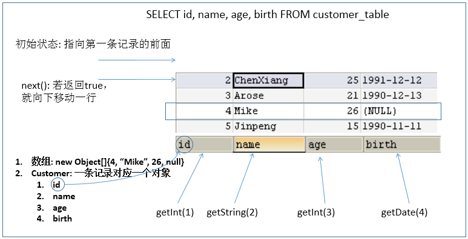

# 本文包含以下元素

- PreparedStatement实现CRUD操作

  - 操作和访问数据库
  - 使用Statement操作数据表的弊端
  - PreparedStatement的使用
  - ResultSet和ResullSetMetaData
  - 资源的释放
  
- 操作BLOB类型字段
  
  - MySQL BLOB类型
  - 向数据表中插入大数据类型
  - 修改数据表中的Blob类型字段
  - 从数据表中读取大数据类型
  
- 批量插入
  
  - 批量执行SQL语句
  - 高校的批量插入
  
  

------

## 使用PreparedStatement实现CRUD操作

### 操作和访问数据库

- 数据库连接被用于向数据库服务器发送命令和 SQL 语句，并接受数据库服务器返回的结果。其实一个数据库连接就是一个Socket连接。

- 在 java.sql 包中有 3 个接口分别定义了对数据库的调用的不同方式：
  - Statement：用于执行静态 SQL 语句并返回它所生成结果的对象。 
  - PrepatedStatement：SQL 语句被预编译并存储在此对象中，可以使用此对象多次高效地执行该语句。
  - CallableStatement：用于执行 SQL 存储过程


### 使用Statement操作数据表的弊端

- 通过调用 Connection 对象的 createStatement() 方法创建该对象。该对象用于执行静态的 SQL 语句，并且返回执行结果。

- Statement 接口中定义了下列方法用于执行 SQL 语句：

  ```sql
  int excuteUpdate(String sql)：执行更新操作INSERT、UPDATE、DELETE
  ResultSet executeQuery(String sql)：执行查询操作SELECT
  ```

- 但是使用Statement操作数据表存在弊端：

  - **问题一：存在拼串操作，繁琐**
  - **问题二：存在SQL注入问题**

- SQL 注入是利用某些系统没有对用户输入的数据进行充分的检查，而在用户输入数据中注入非法的 SQL 语句段或命令(如：SELECT user, password FROM user_table WHERE user='a' OR 1 = ' AND password = ' OR '1' = '1') ，从而利用系统的 SQL 引擎完成恶意行为的做法。

- 对于 Java 而言，要防范 SQL 注入，只要用 PreparedStatement(从Statement扩展而来) 取代 Statement 就可以了。

- 代码演示：

```java
public class StatementTest {

	// 使用Statement的弊端：需要拼写sql语句，并且存在SQL注入的问题
	@Test
	public void testLogin() {
		Scanner scan = new Scanner(System.in);

		System.out.print("用户名：");
		String userName = scan.nextLine();
		System.out.print("密   码：");
		String password = scan.nextLine();

		// SELECT user,password FROM user_table WHERE USER = '1' or ' AND PASSWORD = '='1' or '1' = '1';
		String sql = "SELECT user,password FROM user_table WHERE USER = '" + userName + "' AND PASSWORD = '" + password
				+ "'";
		User user = get(sql, User.class);
		if (user != null) {
			System.out.println("登陆成功!");
		} else {
			System.out.println("用户名或密码错误！");
		}
	}

	// 使用Statement实现对数据表的查询操作
	public <T> T get(String sql, Class<T> clazz) {
		T t = null;

		Connection conn = null;
		Statement st = null;
		ResultSet rs = null;
		try {
			// 1.加载配置文件
			InputStream is = StatementTest.class.getClassLoader().getResourceAsStream("jdbc.properties");
			Properties pros = new Properties();
			pros.load(is);

			// 2.读取配置信息
			String user = pros.getProperty("user");
			String password = pros.getProperty("password");
			String url = pros.getProperty("url");
			String driverClass = pros.getProperty("driverClass");

			// 3.加载驱动
			Class.forName(driverClass);

			// 4.获取连接
			conn = DriverManager.getConnection(url, user, password);

			st = conn.createStatement();

			rs = st.executeQuery(sql);

			// 获取结果集的元数据
			ResultSetMetaData rsmd = rs.getMetaData();

			// 获取结果集的列数
			int columnCount = rsmd.getColumnCount();

			if (rs.next()) {

				t = clazz.newInstance();

				for (int i = 0; i < columnCount; i++) {
					// //1. 获取列的名称
					// String columnName = rsmd.getColumnName(i+1);

					// 1. 获取列的别名
					String columnName = rsmd.getColumnLabel(i + 1);

					// 2. 根据列名获取对应数据表中的数据
					Object columnVal = rs.getObject(columnName);

					// 3. 将数据表中得到的数据，封装进对象
					Field field = clazz.getDeclaredField(columnName);
					field.setAccessible(true);
					field.set(t, columnVal);
				}
				return t;
			}
		} catch (Exception e) {
			e.printStackTrace();
		} finally {
			// 关闭资源
			if (rs != null) {
				try {
					rs.close();
				} catch (SQLException e) {
					e.printStackTrace();
				}
			}
			if (st != null) {
				try {
					st.close();
				} catch (SQLException e) {
					e.printStackTrace();
				}
			}

			if (conn != null) {
				try {
					conn.close();
				} catch (SQLException e) {
					e.printStackTrace();
				}
			}
		}

		return null;
	}
}
```

综上：


###  PreparedStatement的使用

#### PreparedStatement介绍

- 可以通过调用 Connection 对象的 **preparedStatement(String sql)** 方法获取 PreparedStatement 对象

- **PreparedStatement 接口是 Statement 的子接口，它表示一条预编译过的 SQL 语句**

- PreparedStatement 对象所代表的 SQL 语句中的参数用问号(?)来表示，调用 PreparedStatement 对象的 setXxx() 方法来设置这些参数. setXxx() 方法有两个参数，第一个参数是要设置的 SQL 语句中的参数的索引(从 1 开始)，第二个是设置的 SQL 语句中的参数的值

#### PreparedStatement vs Statement

- 代码的可读性和可维护性。

- **PreparedStatement 能最大可能提高性能：**
  - DBServer会对**预编译**语句提供性能优化。因为预编译语句有可能被重复调用，所以**语句在被DBServer的编译器编译后的执行代码被缓存下来，那么下次调用时只要是相同的预编译语句就不需要编译，只要将参数直接传入编译过的语句执行代码中就会得到执行。**
  - 在statement语句中,即使是相同操作但因为数据内容不一样,所以整个语句本身不能匹配,没有缓存语句的意义.事实是没有数据库会对普通语句编译后的执行代码缓存。这样**每执行一次都要对传入的语句编译一次。**
  - (语法检查，语义检查，翻译成二进制命令，缓存)

- PreparedStatement 可以防止 SQL 注入 

#### Java与SQL对应数据类型转换表

| Java类型           | SQL类型                  |
| ------------------ | ------------------------ |
| boolean            | BIT                      |
| byte               | TINYINT                  |
| short              | SMALLINT                 |
| int                | INTEGER                  |
| long               | BIGINT                   |
| String             | CHAR,VARCHAR,LONGVARCHAR |
| byte   array       | BINARY  ,    VAR BINARY  |
| java.sql.Date      | DATE                     |
| java.sql.Time      | TIME                     |
| java.sql.Timestamp | TIMESTAMP                |

#### 使用PreparedStatement实现增、删、改操作

```java
	//通用的增、删、改操作（体现一：增、删、改 ； 体现二：针对于不同的表）
	public void update(String sql,Object ... args){
		Connection conn = null;
		PreparedStatement ps = null;
		try {
			//1.获取数据库的连接
			conn = JDBCUtils.getConnection();
			
			//2.获取PreparedStatement的实例 (或：预编译sql语句)
			ps = conn.prepareStatement(sql);
			//3.填充占位符
			for(int i = 0;i < args.length;i++){
				ps.setObject(i + 1, args[i]);
			}
			
			//4.执行sql语句
			ps.execute();
		} catch (Exception e) {
			
			e.printStackTrace();
		}finally{
			//5.关闭资源
			JDBCUtils.closeResource(conn, ps);
			
		}
	}
```


#### 使用PreparedStatement实现查询操作

```java
	// 通用的针对于不同表的查询:返回一个对象 (version 1.0)
	public <T> T getInstance(Class<T> clazz, String sql, Object... args) {

		Connection conn = null;
		PreparedStatement ps = null;
		ResultSet rs = null;
		try {
			// 1.获取数据库连接
			conn = JDBCUtils.getConnection();

			// 2.预编译sql语句，得到PreparedStatement对象
			ps = conn.prepareStatement(sql);

			// 3.填充占位符
			for (int i = 0; i < args.length; i++) {
				ps.setObject(i + 1, args[i]);
			}

			// 4.执行executeQuery(),得到结果集：ResultSet
			rs = ps.executeQuery();

			// 5.得到结果集的元数据：ResultSetMetaData
			ResultSetMetaData rsmd = rs.getMetaData();

			// 6.1通过ResultSetMetaData得到columnCount,columnLabel；通过ResultSet得到列值
			int columnCount = rsmd.getColumnCount();
			if (rs.next()) {
				T t = clazz.newInstance();
				for (int i = 0; i < columnCount; i++) {// 遍历每一个列

					// 获取列值
					Object columnVal = rs.getObject(i + 1);
					// 获取列的别名:列的别名，使用类的属性名充当
					String columnLabel = rsmd.getColumnLabel(i + 1);
					// 6.2使用反射，给对象的相应属性赋值
					Field field = clazz.getDeclaredField(columnLabel);
					field.setAccessible(true);
					field.set(t, columnVal);

				}

				return t;

			}
		} catch (Exception e) {

			e.printStackTrace();
		} finally {
			// 7.关闭资源
			JDBCUtils.closeResource(conn, ps, rs);
		}

		return null;

	}
```

> 说明：使用PreparedStatement实现的查询操作可以替换Statement实现的查询操作，解决Statement拼串和SQL注入问题。

### ResultSet与ResultSetMetaData

#### ResultSet

- 查询需要调用PreparedStatement 的 executeQuery() 方法，查询结果是一个ResultSet 对象

- ResultSet 对象以逻辑表格的形式封装了执行数据库操作的结果集，ResultSet 接口由数据库厂商提供实现
- ResultSet 返回的实际上就是一张数据表。有一个指针指向数据表的第一条记录的前面。

- ResultSet 对象维护了一个指向当前数据行的**游标**，初始的时候，游标在第一行之前，可以通过 ResultSet 对象的 next() 方法移动到下一行。调用 next()方法检测下一行是否有效。若有效，该方法返回 true，且指针下移。相当于Iterator对象的 hasNext() 和 next() 方法的结合体。
- 当指针指向一行时, 可以通过调用 getXxx(int index) 或 getXxx(int columnName) 获取每一列的值。

  - 例如: getInt(1), getString("name")
  - **注意：Java与数据库交互涉及到的相关Java API中的索引都从1开始。**

- ResultSet 接口的常用方法：
  - boolean next()

  - getString()
  - …



### 资源的释放

- 释放ResultSet, Statement,Connection。
- 数据库连接（Connection）是非常稀有的资源，用完后必须马上释放，如果Connection不能及时正确的关闭将导致系统宕机。Connection的使用原则是**尽量晚创建，尽量早的释放。**
- 可以在finally中关闭，保证及时其他代码出现异常，资源也一定能被关闭。


### JDBC API小结

- 两种思想

  - 面向接口编程的思想

  - ORM思想(object relational mapping)
    - 一个数据表对应一个java类
    - 表中的一条记录对应java类的一个对象
    - 表中的一个字段对应java类的一个属性

  > sql是需要结合列名和表的属性名来写。注意起别名。

- 两种技术

  - JDBC结果集的元数据：ResultSetMetaData
    - 获取列数：getColumnCount()
    - 获取列的别名：getColumnLabel()
  - 通过反射，创建指定类的对象，获取指定的属性并赋值

## 操作BLOB类型字段

### MySQL BLOB类型

- MySQL中，BLOB是一个二进制大型对象，是一个可以存储大量数据的容器，它能容纳不同大小的数据。
- 插入BLOB类型的数据必须使用PreparedStatement，因为BLOB类型的数据无法使用字符串拼接写的。
- MySQL的四种BLOB类型(除了在存储的最大信息量上不同外，他们是等同的)


- 实际使用中根据需要存入的数据大小定义不同的BLOB类型。
- 需要注意的是：如果存储的文件过大，数据库的性能会下降。
- 如果在指定了相关的Blob类型以后，还报错：xxx too large，那么在mysql的安装目录下，找my.ini文件加上如下的配置参数： **max_allowed_packet=16M**。同时注意：修改了my.ini文件之后，需要重新启动mysql服务。

### 向数据表中插入大数据类型

```java
//获取连接
Connection conn = JDBCUtils.getConnection();
		
String sql = "insert into customers(name,email,birth,photo)values(?,?,?,?)";
PreparedStatement ps = conn.prepareStatement(sql);

// 填充占位符
ps.setString(1, "徐海强");
ps.setString(2, "xhq@126.com");
ps.setDate(3, new Date(new java.util.Date().getTime()));
// 操作Blob类型的变量
FileInputStream fis = new FileInputStream("xhq.png");
ps.setBlob(4, fis);
//执行
ps.execute();
		
fis.close();
JDBCUtils.closeResource(conn, ps);

```


### 修改数据表中的Blob类型字段

```java
Connection conn = JDBCUtils.getConnection();
String sql = "update customers set photo = ? where id = ?";
PreparedStatement ps = conn.prepareStatement(sql);

// 填充占位符
// 操作Blob类型的变量
FileInputStream fis = new FileInputStream("coffee.png");
ps.setBlob(1, fis);
ps.setInt(2, 25);

ps.execute();

fis.close();
JDBCUtils.closeResource(conn, ps);
```


### 从数据表中读取大数据类型

```java
String sql = "SELECT id, name, email, birth, photo FROM customer WHERE id = ?";
conn = getConnection();
ps = conn.prepareStatement(sql);
ps.setInt(1, 8);
rs = ps.executeQuery();
if(rs.next()){
	Integer id = rs.getInt(1);
    String name = rs.getString(2);
	String email = rs.getString(3);
    Date birth = rs.getDate(4);
	Customer cust = new Customer(id, name, email, birth);
    System.out.println(cust); 
    //读取Blob类型的字段
	Blob photo = rs.getBlob(5);
	InputStream is = photo.getBinaryStream();
	OutputStream os = new FileOutputStream("c.jpg");
	byte [] buffer = new byte[1024];
	int len = 0;
	while((len = is.read(buffer)) != -1){
		os.write(buffer, 0, len);
	}
    JDBCUtils.closeResource(conn, ps, rs);
		
	if(is != null){
		is.close();
	}
		
	if(os !=  null){
		os.close();
	}
    
}

```


## 批量插入

### 批量执行SQL语句

当需要成批插入或者更新记录时，可以采用Java的批量**更新**机制，这一机制允许多条语句一次性提交给数据库批量处理。通常情况下比单独提交处理更有效率

JDBC的批量处理语句包括下面三个方法：

- **addBatch(String)：添加需要批量处理的SQL语句或是参数；**
- **executeBatch()：执行批量处理语句；**
- **clearBatch():清空缓存的数据**

通常我们会遇到两种批量执行SQL语句的情况：

- 多条SQL语句的批量处理；
- 一个SQL语句的批量传参；


### 高效的批量插入

举例：向数据表中插入20000条数据

- 数据库中提供一个goods表。创建如下：

```sql
CREATE TABLE goods(
id INT PRIMARY KEY AUTO_INCREMENT,
NAME VARCHAR(20)
);
```


#### 实现层次一：使用Statement

```java
Connection conn = JDBCUtils.getConnection();
Statement st = conn.createStatement();
for(int i = 1;i <= 20000;i++){
	String sql = "insert into goods(name) values('name_' + "+ i +")";
	st.executeUpdate(sql);
}
```


#### 实现层次二：使用PreparedStatement

```java
long start = System.currentTimeMillis();
		
Connection conn = JDBCUtils.getConnection();
		
String sql = "insert into goods(name)values(?)";
PreparedStatement ps = conn.prepareStatement(sql);
for(int i = 1;i <= 20000;i++){
	ps.setString(1, "name_" + i);
	ps.executeUpdate();
}
		
long end = System.currentTimeMillis();
System.out.println("花费的时间为：" + (end - start));//82340
		
		
JDBCUtils.closeResource(conn, ps);
```

#### 实现层次三

```java
/*
 * 修改1： 使用 addBatch() / executeBatch() / clearBatch()
 * 修改2：mysql服务器默认是关闭批处理的，我们需要通过一个参数，让mysql开启批处理的支持。
 * 		 ?rewriteBatchedStatements=true 写在配置文件的url后面
 * 修改3：使用更新的mysql 驱动：mysql-connector-java-5.1.37-bin.jar
 * 
 */
@Test
public void testInsert1() throws Exception{
	long start = System.currentTimeMillis();
		
	Connection conn = JDBCUtils.getConnection();
		
	String sql = "insert into goods(name)values(?)";
	PreparedStatement ps = conn.prepareStatement(sql);
		
	for(int i = 1;i <= 1000000;i++){
		ps.setString(1, "name_" + i);
			
		//1.“攒”sql
		ps.addBatch();
		if(i % 500 == 0){
			//2.执行
			ps.executeBatch();
			//3.清空
			ps.clearBatch();
		}
	}
		
	long end = System.currentTimeMillis();
	System.out.println("花费的时间为：" + (end - start));//20000条：625                                                                         //1000000条:14733  
		
	JDBCUtils.closeResource(conn, ps);
}
```

#### 实现层次四

```java
/*
* 层次四：在层次三的基础上操作
* 使用Connection 的 setAutoCommit(false)  /  commit()
*/
@Test
public void testInsert2() throws Exception{
	long start = System.currentTimeMillis();
		
	Connection conn = JDBCUtils.getConnection();
		
	//1.设置为不自动提交数据
	conn.setAutoCommit(false);
		
	String sql = "insert into goods(name)values(?)";
	PreparedStatement ps = conn.prepareStatement(sql);
		
	for(int i = 1;i <= 1000000;i++){
		ps.setString(1, "name_" + i);
			
		//1.“攒”sql
		ps.addBatch();
			
		if(i % 500 == 0){
			//2.执行
			ps.executeBatch();
			//3.清空
			ps.clearBatch();
		}
	}
		
	//2.提交数据
	conn.commit();
		
	long end = System.currentTimeMillis();
	System.out.println("花费的时间为：" + (end - start));//1000000条:4978 
		
	JDBCUtils.closeResource(conn, ps);
}
```

