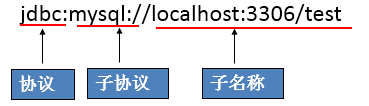

# 本文包含以下元素

- JDBC概述
  - 数据的持久化
  - 介绍
  - 体系结构
- 获取数据库连接三要素
  - Driver接口实现类
  - URL
  - 用户名和密码
- 连接方式

------

# JDBC基本概念

## JDBC概述

###  数据的持久化

- 持久化(persistence)：**把数据保存到可掉电式存储设备中以供之后使用**。大多数情况下，特别是企业级应用，**数据持久化意味着将内存中的数据保存到硬盘**上加以”固化”**，而持久化的实现过程大多通过各种关系数据库来完成**。
- 持久化的主要应用是将内存中的数据存储在关系型数据库中，当然也可以存储在磁盘文件、XML数据文件中。


###  Java中的数据存储技术

- 在Java中，数据库存取技术可分为如下几类：
  - **JDBC**直接访问数据库
  - JDO (Java Data Object )技术

  - **第三方O/R工具**，如Hibernate, Mybatis 等

- JDBC是java访问数据库的基石，JDO、Hibernate、MyBatis等只是更好的封装了JDBC。

### JDBC介绍

- JDBC(Java Database Connectivity)是一个**独立于特定数据库管理系统、通用的SQL数据库存取和操作的公共接口**（一组API），定义了用来访问数据库的标准Java类库，（**java.sql,javax.sql**）使用这些类库可以以一种**标准**的方法、方便地访问数据库资源。
- JDBC为访问不同的数据库提供了一种**统一的途径**，为开发者屏蔽了一些细节问题。
- JDBC的目标是使Java程序员使用JDBC可以连接任何**提供了JDBC驱动程序**的数据库系统，这样就使得程序员无需对特定的数据库系统的特点有过多的了解，从而大大简化和加快了开发过程。
- 如果没有JDBC，那么Java程序访问数据库时是这样的：


------

有了JDBC，Java程序访问数据库时是这样的：


***

- 总结如下：


### JDBC体系结构

- JDBC接口（API）包括两个层次：
  - **面向应用的API**：Java API，抽象接口，供应用程序开发人员使用（连接数据库，执行SQL语句，获得结果）。
  - **面向数据库的API**：Java Driver API，供开发商开发数据库驱动程序用。

> **JDBC是sun公司提供一套用于数据库操作的接口，java程序员只需要面向这套接口编程即可。**
>
> **不同的数据库厂商，需要针对这套接口，提供不同实现。不同的实现的集合，即为不同数据库的驱动。																————面向接口编程**

### JDBC程序编写步骤


> 补充：ODBC(**Open Database Connectivity**，开放式数据库连接)，是微软在Windows平台下推出的。使用者在程序中只需要调用ODBC API，由 ODBC 驱动程序将调用转换成为对特定的数据库的调用请求。

## 获取数据库连接

### 要素一：Driver接口实现类

#### Driver接口介绍

- java.sql.Driver 接口是所有 JDBC 驱动程序需要实现的接口。这个接口是提供给数据库厂商使用的，不同数据库厂商提供不同的实现。

- 在程序中不需要直接去访问实现了 Driver 接口的类，而是由驱动程序管理器类(java.sql.DriverManager)去调用这些Driver实现。
  - Oracle的驱动：**oracle.jdbc.driver.OracleDriver**
  - mySql的驱动： **com.mysql.jdbc.Driver**

将上述jar包拷贝到Java工程的一个目录中，习惯上新建一个lib文件夹。

#### 加载与注册JDBC驱动

- 加载驱动：加载 JDBC 驱动需调用 Class 类的静态方法 forName()，向其传递要加载的 JDBC 驱动的类名

  - **Class.forName(“com.mysql.jdbc.Driver”);**

- 注册驱动：DriverManager 类是驱动程序管理器类，负责管理驱动程序
  - **使用DriverManager.registerDriver(com.mysql.jdbc.Driver)来注册驱动**

  - 通常不用显式调用 DriverManager 类的 registerDriver() 方法来注册驱动程序类的实例，因为 Driver 接口的驱动程序类**都**包含了静态代码块，在这个静态代码块中，会调用 DriverManager.registerDriver() 方法来注册自身的一个实例。下图是MySQL的Driver实现类的源码：

###  要素二：URL

- JDBC URL 用于标识一个被注册的驱动程序，驱动程序管理器通过这个 URL 选择正确的驱动程序，从而建立到数据库的连接。

- JDBC URL的标准由三部分组成，各部分间用冒号分隔。 
  - **jdbc:子协议:子名称**
  - **协议**：JDBC URL中的协议总是jdbc 
  - **子协议**：子协议用于标识一个数据库驱动程序
  - **子名称**：一种标识数据库的方法。子名称可以依不同的子协议而变化，用子名称的目的是为了**定位数据库**提供足够的信息。包含**主机名**(对应服务端的ip地址)**，端口号，数据库名**

- 举例：



**几种常用数据库的 JDBC URL**

- MySQL的连接URL编写方式：

  - jdbc:mysql://主机名称:mysql服务端口号/数据库名称?参数=值&参数=值
  - jdbc:mysql://localhost:3306/atguigu
  - jdbc:mysql://localhost:3306/atguigu**?useUnicode=true&characterEncoding=utf8**（如果JDBC程序与服务器端的字符集不一致，会导致乱码，那么可以通过参数指定服务器端的字符集）
  - jdbc:mysql://localhost:3306/atguigu?user=root&password=123456

- Oracle 9i的连接URL编写方式：

  - jdbc:oracle:thin:@主机名称:oracle服务端口号:数据库名称
  - jdbc:oracle:thin:@localhost:1521:atguigu

- SQLServer的连接URL编写方式：

  - jdbc:sqlserver://主机名称:sqlserver服务端口号:DatabaseName=数据库名称

  - jdbc:sqlserver://localhost:1433:DatabaseName=atguigu

### 要素三：用户名和密码

- user,password可以用“属性名=属性值”方式告诉数据库
- 可以调用 DriverManager 类的 getConnection() 方法建立到数据库的连接

### 数据库连接方式举例

#### 连接方式一

```java
	@Test
    public void testConnection1() {
        try {
            //1.提供java.sql.Driver接口实现类的对象
            Driver driver = null;
            driver = new com.mysql.jdbc.Driver();

            //2.提供url，指明具体操作的数据
            String url = "jdbc:mysql://localhost:3306/test";

            //3.提供Properties的对象，指明用户名和密码
            Properties info = new Properties();
            info.setProperty("user", "root");
            info.setProperty("password", "123456");

            //4.调用driver的connect()，获取连接
            Connection conn = driver.connect(url, info);
            System.out.println(conn);
        } catch (SQLException e) {
            e.printStackTrace();
        }
    }
```

> 说明：上述代码中显式出现了第三方数据库的API

#### 连接方式二

```java
	@Test
    public void testConnection2() {
        try {
            //1.实例化Driver
            String className = "com.mysql.jdbc.Driver";
            Class clazz = Class.forName(className);
            Driver driver = (Driver) clazz.newInstance();

            //2.提供url，指明具体操作的数据
            String url = "jdbc:mysql://localhost:3306/test";

            //3.提供Properties的对象，指明用户名和密码
            Properties info = new Properties();
            info.setProperty("user", "root");
            info.setProperty("password", "123456");

            //4.调用driver的connect()，获取连接
            Connection conn = driver.connect(url, info);
            System.out.println(conn);

        } catch (Exception e) {
            e.printStackTrace();
        }
    }
```

> 说明：相较于方式一，这里使用反射实例化Driver，不在代码中体现第三方数据库的API。体现了面向接口编程思想。

#### 连接方式三

```java
	@Test
    public void testConnection3() {
        try {
            //1.数据库连接的4个基本要素：
            String url = "jdbc:mysql://localhost:3306/test";
            String user = "root";
            String password = "123456";
            String driverName = "com.mysql.jdbc.Driver";

            //2.实例化Driver
            Class clazz = Class.forName(driverName);
            Driver driver = (Driver) clazz.newInstance();
            //3.注册驱动
            DriverManager.registerDriver(driver);
            //4.获取连接
            Connection conn = DriverManager.getConnection(url, user, password);
            System.out.println(conn);
        } catch (Exception e) {
            e.printStackTrace();
        }

    }
```

> 说明：使用DriverManager实现数据库的连接。体会获取连接必要的4个基本要素。

#### 连接方式四

```java
	@Test
    public void testConnection4() {
        try {
            //1.数据库连接的4个基本要素：
            String url = "jdbc:mysql://localhost:3306/test";
            String user = "root";
            String password = "123456";
            String driverName = "com.mysql.jdbc.Driver";

            //2.加载驱动 （①实例化Driver ②注册驱动）
            Class.forName(driverName);


            //Driver driver = (Driver) clazz.newInstance();
            //3.注册驱动
            //DriverManager.registerDriver(driver);
            /*
            可以注释掉上述代码的原因，是因为在mysql的Driver类中声明有：
            static {
                try {
                    DriverManager.registerDriver(new Driver());
                } catch (SQLException var1) {
                    throw new RuntimeException("Can't register driver!");
                }
            }

             */


            //3.获取连接
            Connection conn = DriverManager.getConnection(url, user, password);
            System.out.println(conn);
        } catch (Exception e) {
            e.printStackTrace();
        }

    }
```

> 说明：不必显式的注册驱动了。因为在DriverManager的源码中已经存在静态代码块，实现了驱动的注册。

#### 连接方式五(最终)

```java
	@Test
    public  void testConnection5() throws Exception {
    	//1.加载配置文件
        InputStream is = ConnectionTest.class.getClassLoader().getResourceAsStream("jdbc.properties");
        Properties pros = new Properties();
        pros.load(is);
        
        //2.读取配置信息
        String user = pros.getProperty("user");
        String password = pros.getProperty("password");
        String url = pros.getProperty("url");
        String driverClass = pros.getProperty("driverClass");

        //3.加载驱动
        Class.forName(driverClass);

        //4.获取连接
        Connection conn = DriverManager.getConnection(url,user,password);
        System.out.println(conn);

    }
```

其中，配置文件声明在工程的src目录下：【jdbc.properties】

```properties
user=root
password=123456
url=jdbc:mysql://localhost:3306/test
driverClass=com.mysql.jdbc.Driver
```

> 说明：使用配置文件的方式保存配置信息，在代码中加载配置文件
>
> **使用配置文件的好处：**
>
> ①实现了代码和数据的分离，如果需要修改配置信息，直接在配置文件中修改，不需要深入代码
> ②如果修改了配置信息，省去重新编译的过程。
